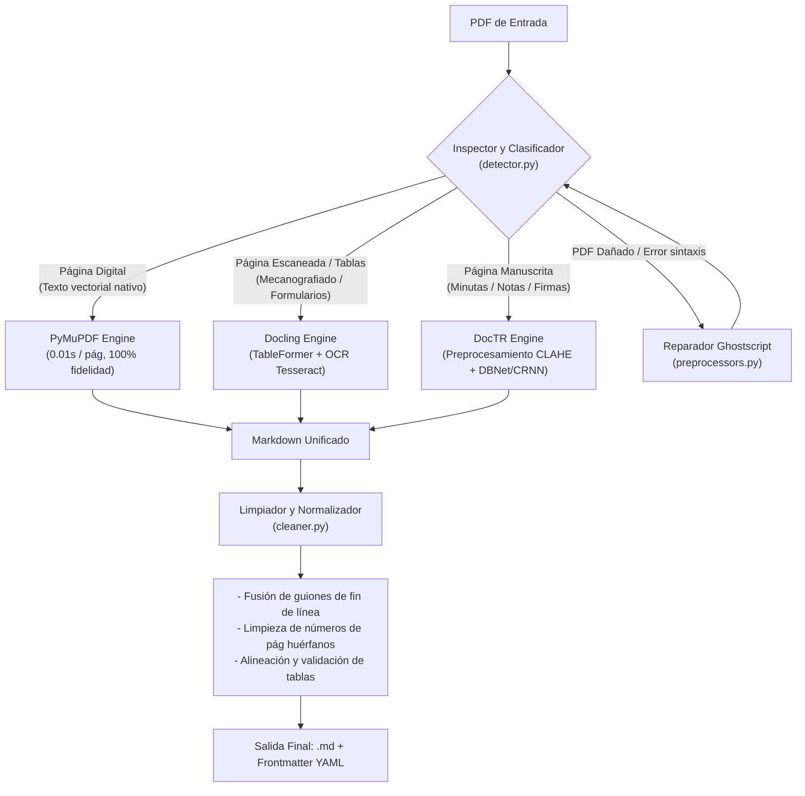

# agy_ocr_md: Pipeline Inteligente de OCR y Extracción a Markdown (.md)

Pipeline modular en Python diseñado para procesar cualquier tipo de documento PDF (digital nativo, mecanografiado escaneado, tablas complejas o manuscritos antiguos) y generar un archivo **Markdown (.md)** estructurado, limpio y enriquecido con metadatos.

---

## 🏗️ Arquitectura del Pipeline



---

## 🚀 Características Principales

1. **Enrutamiento Inteligente por Página (Router Híbrido):**
   No procesa todo el archivo a ciegas con el mismo motor. Clasifica cada página según densidad de caracteres vectoriales, cobertura de imágenes y patrones de manuscrito.
2. **Tablas Markdown Perfectas:**
   Aprovecha el modelo `TableFormer` de Docling para preservar la estructura tabular en formato GitHub Flavored Markdown (`| col1 | col2 |`).
3. **Soporte para Manuscritos con Preprocesamiento:**
   Utiliza `DocTR` junto con filtros OpenCV (CLAHE, binarización adaptativa) para extraer texto en bitácoras y minutas.
4. **Postprocesamiento y Limpieza de Markdown:**
   - Une palabras cortadas por guion a fin de línea (`cons-\ntitución` $\rightarrow$ `constitución`).
   - Elimina numeraciones de página repetitivas o huérfanas.
   - Normaliza divisores de tablas Markdown.
5. **Autoreparación de PDFs:**
   Si un archivo presenta corrupción de xref o errores de formato, Ghostscript lo reconstruye automáticamente antes de la extracción.
6. **Frontmatter YAML Enriquecido:**
   Cada archivo `.md` incluye cabecera con ruta de origen, total de páginas, motores utilizados, tablas detectadas y fecha de procesamiento.

---

## 📦 Instalación

### 1. Dependencias del Sistema Operativo (Linux / WSL / Ubuntu):
```bash
sudo apt-get update && sudo apt-get install -y \
    tesseract-ocr \
    tesseract-ocr-spa \
    poppler-utils \
    ghostscript
```

### 2. Dependencias de Python:
```bash
cd /home/wrozoa/obsidian/herramientas_Py_RStudio/src/agy_ocr_md
pip install -r requirements.txt
```

---

## 💻 Uso desde la Línea de Comandos (CLI)

### Procesar un archivo individual:
```bash
python -m agy_ocr_md.cli -i /ruta/documento.pdf -o /ruta/salida.md
```

### Procesar una carpeta completa de PDFs (recursivo) con reporte CSV:
```bash
python -m agy_ocr_md.cli -i /ruta/carpeta_pdfs -o /ruta/destino_md
```

### Forzar un motor específico:
- Modo Docling (para documentos con muchas tablas):
  ```bash
  python -m agy_ocr_md.cli -i archivo.pdf --mode docling
  ```
- Modo Manuscrito (DocTR):
  ```bash
  python -m agy_ocr_md.cli -i minuta.pdf --mode doctr --dpi-handwritten 350
  ```

---

## 🐍 Uso desde Código Python

```python
from pathlib import Path
from agy_ocr_md import AgyOcrPipeline, PipelineConfig

config = PipelineConfig(
    language="spa+eng",
    dpi_default=300,
    clean_markdown=True,
    merge_hyphenated_words=True,
    skip_existing=True
)

pipeline = AgyOcrPipeline(config)

# Procesar archivo individual
resultado = pipeline.process_file(
    pdf_path=Path("expediente.pdf"),
    output_md_path=Path("expediente.md")
)
print(f"Estado: {resultado['estado']}, Tablas: {resultado['tablas']}")

# O procesar carpeta completa
log_csv = pipeline.process_directory(
    input_dir=Path("./documentos_entrada"),
    output_dir=Path("./documentos_md")
)
print(f"Reporte guardado en: {log_csv}")
```
